# Agent 开发工程师 — 学习路线图

> **背景**: 10 年 Java 开发经验 | **目标**: Agent 开发工程师
> **预估总时程**: 主幹 **16-22 週**（每週 8-12 hr），现实 **4-6 个月**
> **来源**: 基于 [awesome-agentic-ai-zh](https://github.com/stevexu7308509/awesome-agentic-ai-zh) 精炼
> 
> 🟢 = Java 经验可直接复用　🟡 = 部分关联需学习　🔴 = 全新领域需重点突破

---

## 🗺️ 总览：学习路线全景图

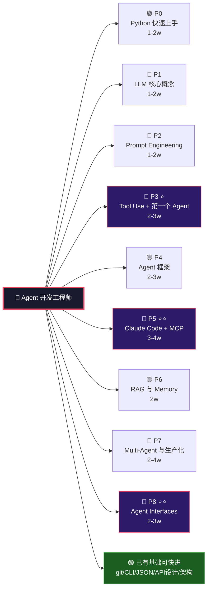

> 图例：🟢 Java 经验可直接复用　🟡 部分关联需学习　🔴 全新领域需重点突破　⭐ 核心阶段

---

## P0 🟢 Python 快速上手（1-2 周）

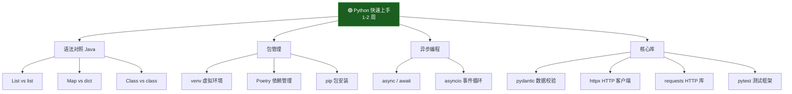

> **Java 对照**: `List<T>`→`list`, `Map<K,V>`→`dict`, Maven→Poetry, `CompletableFuture`→`async/await`
> **不学**: Django/Flask、NumPy/Pandas、Python 多线程

---

## P1 🔴 LLM 核心概念（1-2 周）

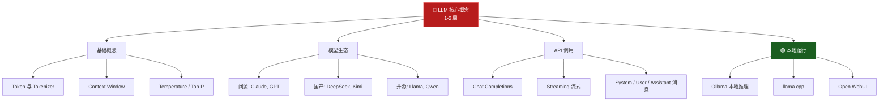

> **全新领域**: Java 经验在这里几乎帮不上忙，需从零建立 LLM 的 mental model

---

## P2 🔴 Prompt Engineering（1-2 周）

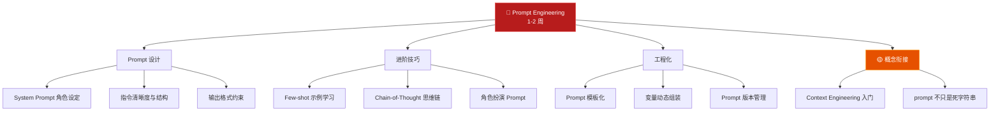

> **Java 关联**: prompt 设计 ≈ REST API 的 request schema 设计——需要同样严谨

---

## P3 🔴⭐ Tool Use 与第一个 Agent（2-3 周）

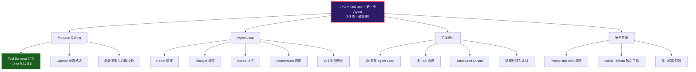

> ⚠️ **Agent = LLM + Tools + Loop**，这是整个路线最关键的阶段，必须手写代码

---

## P4 🟡 Agent 框架（2-3 周）

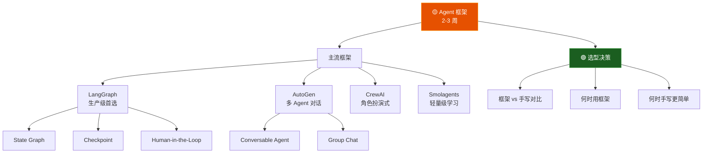

> **Java 关联**: 学框架 ≈ 学 Spring——手写过 agent loop 再学框架，你才会用也会改

---

## P5 🔴⭐⭐ Claude Code 生态 + MCP（3-4 周）

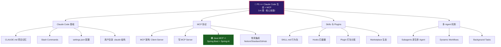

> 🔥 **Java 杀手锏**: MCP Server 可以用 Spring Boot 写！你的 Java 微服务加 MCP 层 = agent 工具

---

## P6 🟡 RAG 与 Memory（2 周）

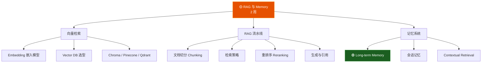

> **Java 关联**: 向量数据库分片策略 ≈ MySQL/Redis 分库分表；RAG pipeline ≈ ETL 数据流

---

## P7 🔴 Multi-Agent 与生产化（2-4 周）

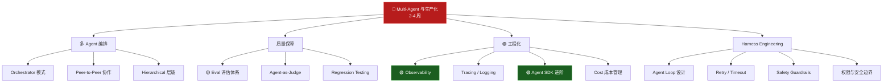

> **Java 关联**: 编排 ≈ 微服务编排(Kafka/Spring Cloud)；可观测性 ≈ APM(Prometheus/Grafana)

---

## P8 🔴⭐⭐ Agent Interfaces（2-3 周）

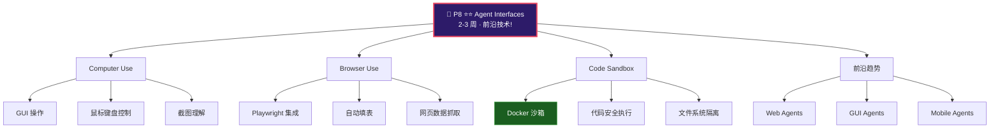

> **Java 关联**: Code Sandbox ≈ Docker 容器 + 安全沙箱；Computer/Browser Use 是全新领域

---

## 📋 延伸路线（完成主幹后选读）

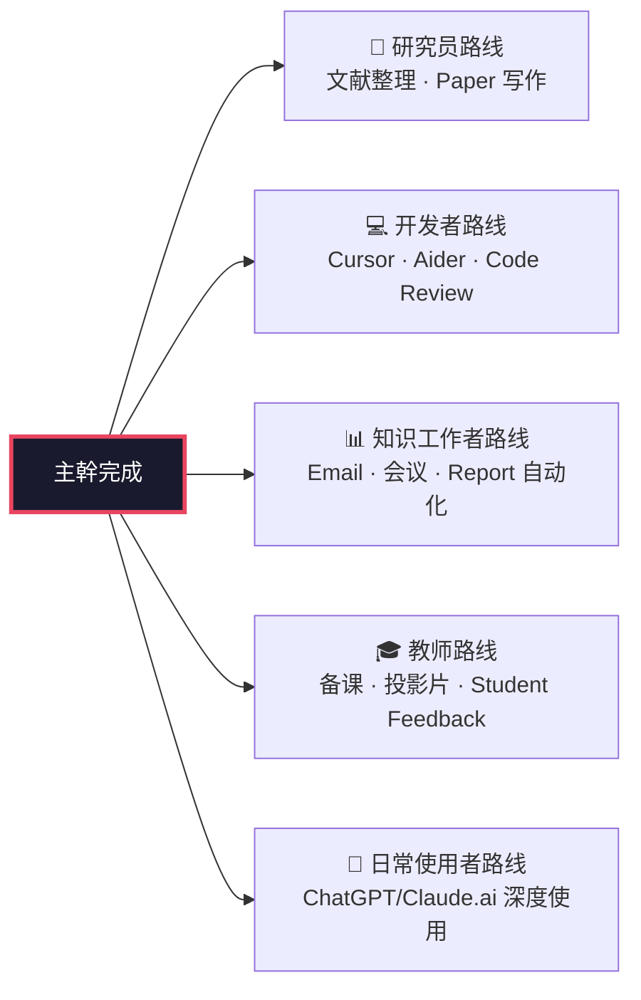

---

## 📋 精炼学习阶段

### 阶段 0: Python 快速上手 🟢 → `1-2 週`

> 10 年 Java 经验不需要从头学编程。目标是**熟练 Python 语法到能流畅读/写 AI 项目代码**。

| 学什么 | 为什么 | Java 对照 |
|--------|--------|-----------|
| Python 语法基础 | AI 生态 95% 用 Python | `List<T>` → `list`, `Map<K,V>` → `dict` |
| venv / Poetry | 包管理 | Maven / Gradle |
| `async` / `await` | Agent 调用 LLM 是 IO 密集型 | `CompletableFuture` |
| `pydantic` | LLM 的结构化输出 | Lombok / Java Record |
| `httpx` / `requests` | HTTP 调用 LLM API | OkHttp / RestTemplate |
| `pytest` | 测试框架 | JUnit |

**不学**: Python 多线程、Django/Flask Web 框架、NumPy/Pandas 数据分析

**怎么做**:
- 看 [Python 官方教程](https://docs.python.org/3/tutorial/) 前 6 章（2-3 天）
- 重点：找一段 Python agent 代码，逐行读通，不懂就查
- 不需要学到能写大型 Python 项目，够看懂和改写 agent 代码即可

---

### 阶段 1: LLM 核心概念 🔴 → `1-2 週`

> 这是**最关键的认知基础**。Java 经验在这里几乎帮不上忙，需要从零建立 LLM 的 mental model。

| 学什么 | 核心问题 |
|--------|----------|
| **Token & Tokenizer** | LLM 怎么"数"文字？中文 vs 英文 token 差多少？|
| **Context Window** | LLM 一次能"记住"多少内容？128K context 能装什么？|
| **Temperature / Top-P / Top-K** | 怎么控制 LLM 输出"创造力"？|
| **Chat Completions API** | 怎么用 API 调用 LLM？ |
| **主流模型对比** | Claude / GPT / DeepSeek / Llama / Qwen 各有什么特点？|
| **本地 LLM (Ollama)** | 不联网怎么跑 LLM？成本对比 |

**必读资源**:
- 🎥 [Andrej Karpathy — Intro to LLMs](https://www.youtube.com/watch?v=zjkBMFhNj_g) (1hr)
- 🎥 [3Blue1Brown — Transformer 可视化](https://www.youtube.com/watch?v=wjZofJX0v4M)
- 📄 [Anthropic API 文档 Quickstart](https://docs.anthropic.com/en/docs)

**动手**:
- 申请 Anthropic API Key，用 Python 写第一个 Chat Completions 调用
- 装 Ollama，本地跑 `qwen2.5:3b`，对比速度和效果

---

### 阶段 2: Prompt Engineering 🔴 → `1-2 週`

> 学会**如何跟 LLM 说话**。这不是普通 API 调用，是概率性系统——同样的 prompt 可以出完全不同质量的答案。

| 学什么 | 关键技术 |
|--------|----------|
| **System Prompt** | 设定 LLM 角色、边界、输出格式 |
| **Few-shot Prompting** | 给例子让 LLM 模仿 |
| **Chain-of-Thought (CoT)** | 让 LLM "一步步想" |
| **Prompt 模板化** | 用变量动态组装 prompt |
| **Context Engineering 入门** | prompt 是动态组装的——不是写的死字符串 |

**Java 关联**: 你设计过 REST API 的 request/response schema，prompt 就是"自然语言 API"的请求格式——需要同样严谨的设计思维。

**必读资源**:
- 📄 [Anthropic — Prompt Engineering Guide](https://docs.anthropic.com/en/docs/build-with-claude/prompt-engineering/overview)
- 📄 [OpenAI — Prompt Engineering Guide](https://platform.openai.com/docs/guides/prompt-engineering)

**动手**:
- 写 5 个不同任务的 system prompt，对比效果
- 同一个问题，用 CoT 和不用的差异测试

---

### 阶段 3: Tool Use 与第一个 Agent 🔴⭐ → `2-3 週`

> **这是整个学习路线最重要的一站**。Agent = LLM + Tools + Loop。建过一个 agent 才算真懂。

| 学什么 | 为什么重要 |
|--------|------------|
| **Function Calling** | LLM 怎么"调用"你的函数？|
| **Tool Schema 设计** | 怎么用 JSON Schema 描述一个函数？等于写 API 文档 |
| **ReAct 循环** | Thought → Action → Observation → Thought... |
| **手写 Agent Loop** | 不依赖任何框架，从零写出 agent |
| **Structured Output** | 让 LLM 返回固定 JSON，不是自由文本 |
| **Prompt Injection 认知** | 给 agent 工具 = 给它攻击面 |

**Java 关联**: Tool Schema 设计 ≈ Java 接口设计。你定义过多少 API 就理解 tool schema 多重要。参数类型、必填字段、描述清晰度——这些经验和 API 设计一模一样。

**必读资源**:
- 📄 [Anthropic — Tool Use 文档](https://docs.anthropic.com/en/docs/agents-and-tools/tool-use/overview)
- 📄 [ReAct Paper (Yao 2022)](https://arxiv.org/abs/2210.03629)
- 📄 [Lilian Weng — LLM Powered Agents](https://lilianweng.github.io/posts/2023-06-23-agent/)
- 📄 [Anthropic — Building Effective Agents](https://www.anthropic.com/research/building-effective-agents)

**动手**（必须自己写一遍）:
1. 定义一个天气查询 tool schema，让 LLM 调用
2. 写单步 ReAct agent（LLM 调用 tool → 拿到结果 → 回答）
3. 写多步 ReAct agent（LLM 自主判断何时停）
4. 给 agent 加 2 个以上的 tools，让 LLM 自己选

---

### 阶段 4: Agent 框架 🟡 → `2-3 週`

> 框架是帮你搭 agent 骨架的工具。**先手写过 agent 再学框架**——否则只会用不会改。

| 学什么 | 定位 |
|--------|------|
| **LangGraph** | 最主流的 agent 框架，DAG 工作流 |
| **AutoGen** (Microsoft) | 多 agent 对话模式 |
| **CrewAI** | 角色扮演式多 agent |
| **Smolagents** (HuggingFace) | 轻量级 agent，源码简练 |

**Java 关联**: 学框架就像学 Spring——理解了 DI/IoC 再学 Spring 很快。你已经手写过 agent loop，学框架就是看它们怎么帮你管理 state、tools、loop。

**框架选型建议**:
- 生产级首选 **LangGraph**（生态最完善）
- 快速做多 agent 协作用 **AutoGen**
- 简单项目直接用 **Anthropic SDK + 手写 loop**（不需要框架）

**必读资源**:
- 📄 [LangGraph 官方教程](https://langchain-ai.github.io/langgraph/tutorials/)
- 📄 [AutoGen 官方文档](https://microsoft.github.io/autogen/)

**动手**:
- 用 LangGraph 重写阶段 3 的 ReAct agent
- 对比框架版和自己手写版的差异（代码量、灵活性、调试体验）

---

### 阶段 5: Claude Code 生态 + MCP 🔴⭐⭐ → `3-4 週`

> 这是 **Agent 开发工程师最核心的技术栈**。MCP (Model Context Protocol) 已变成 agent 工具接入的行业标准，就像 HTTP 之于 Web。

| 学什么 | 为什么关键 |
|--------|------------|
| **Claude Code 基础** | CLAUDE.md、slash commands、settings.json |
| **MCP 协议** | agent 与外部工具的标准化协议 |
| **写 MCP Server** | 把任何 API/服务包成 agent 能用的 tool |
| **Skills** | Claude Code 的行为包（SKILL.md）|
| **Plugins** | 打包 skills/hooks/commands 分发 |
| **Subagents** | 多 agent 原生机制 |
| **Dynamic Workflows** | 复杂工作流编排 |

**Java 关键连接** 🔥: MCP Server 可以用 Java 写！这是你最熟悉的领域。
- [Spring AI MCP](https://docs.spring.io/spring-ai/reference/api/mcp.html) — Spring 官方 MCP 支持
- [Quarkus MCP](https://github.com/quarkiverse/quarkus-mcp-server) — Quarkus MCP Server
- 你写的 Java 微服务，加个 MCP 层就能被 Claude Code / Cursor / 任何 MCP client 调用

**必读资源**:
- 📄 [Model Context Protocol 官方](https://modelcontextprotocol.io/)
- 📄 [Anthropic — Claude Code 文档](https://docs.claude.com/en/docs/claude-code/overview)
- 📄 [Spring AI MCP](https://docs.spring.io/spring-ai/reference/api/mcp.html)
- 📄 [MCP Server 开发指南](https://modelcontextprotocol.io/docs/concepts/architecture)

**动手**:
1. 用 Claude Code 完成一个真实开发任务（建立使用习惯）
2. 写一个简单的 Python MCP server
3. **用 Spring Boot 写一个 Java MCP server**（你的优势领域！）
4. 写一个 SKILL.md，给 Claude Code 装你自己的 skill
5. 试试 subagent：让 Claude Code 同时处理 2 个任务

---

### 阶段 6: 上下文管理 — RAG & Memory 🟡 → `2 週`

> Agent 不能每次对话都从零开始。**Memory 和 RAG 是 agent 的"长期记忆"**。

| 学什么 | 核心概念 |
|--------|----------|
| **Vector Embedding** | 文字 → 向量 → 语义搜索 |
| **Vector DB** | Chroma / Pinecone / Qdrant / Milvus |
| **RAG (检索增强生成)** | 查资料 → 塞进 context → 回答 |
| **Long-term Memory** | agent 记住跨 session 的信息 |
| **Contextual Retrieval** | Anthropic 的上下文检索方案 |

**Java 关联**: 
- 向量数据库的选型、分片策略 → 你做过 MySQL/Redis 分库分表，思路相通
- RAG pipeline 的数据流 → ETL pipeline 设计经验直接用

**必读资源**:
- 📄 [Anthropic — Contextual Retrieval](https://www.anthropic.com/news/contextual-retrieval)
- 📄 [LangChain — RAG 教程](https://python.langchain.com/docs/tutorials/rag/)

**动手**:
- 搭一个 RAG pipeline：文档 → embedding → 存 Chroma → 检索 → 回答
- 给之前写的 agent 加一个长期记忆（存到 SQLite/文件）

---

### 阶段 7: 多 Agent 系统与生产化 🔴 → `2-4 週`

> 一个 agent 不够用，就需要多个 agent 协作。**生产级 agent 不只是能跑——要稳定、可观测、能评估**。

| 学什么 | 关键点 |
|--------|--------|
| **Multi-Agent 编排** | Orchestrator / Peer-to-Peer / Hierarchical |
| **Agent-as-Judge** | 让一个 agent 评估另一个 agent 的输出 |
| **Eval 评估体系** | 怎么判断 agent 做得好不好？|
| **Observability** | tracing、logging、metrics |
| **Harness Engineering** | Agent Loop 设计、Retry/Timeout、Safety Guardrails |
| **Agent SDK 进阶** | Anthropic Agent SDK 深度使用 |

**Java 关联**: 这就是把 agent 当作微服务来管。
- 编排模式≈服务编排（你写过 Spring Cloud / Kafka 就用过）
- 可观测性≈APM（Prometheus / Grafana / OpenTelemetry）
- 评估体系≈单元测试 + 集成测试 + SLA 指标

**必读资源**:
- 📄 [Anthropic Agent SDK](https://docs.claude.com/en/docs/agent-sdk/overview)
- 📄 [LangGraph Multi-Agent](https://langchain-ai.github.io/langgraph/concepts/multi_agent/)

**动手**:
- 设计一个 2-agent 协作系统（一个查资料、一个写报告）
- 给 agent 加 tracing（用 LangSmith 或 LangFuse）
- 写一套 eval：至少 10 个测试用例 + 评分标准

---

### 阶段 8: Agent 操作介面 🔴⭐⭐ → `2-3 週`

> 2025-2026 最前沿：agent 不再只会调 API——它能**操作电脑、浏览网页、执行代码**。

| 学什么 | 能做什么 |
|--------|----------|
| **Computer Use** | agent 控制鼠标键盘，操作 GUI |
| **Browser Use** | agent 打开浏览器填表单、抓数据 |
| **Code Sandbox** | agent 在隔离环境跑代码 |
| **前沿趋势** | Web Agents、GUI Agents、Mobile Agents |

**Java 关联**: Code Sandbox ≈ Docker 容器 + 安全沙箱，你用过的容器化经验直接适用。Computer Use 和 Browser Use 是全新领域。

**必读资源**:
- 📄 [Anthropic — Computer Use](https://docs.anthropic.com/en/docs/agents-and-tools/computer-use)
- 📄 [Browser Use 项目](https://github.com/browser-use/browser-use)

**动手**:
- 用 Playwright + LLM 写一个简单的 web agent（自动查航班价格）
- 尝试在 Docker 里搭 Code Sandbox

---

## 🧭 你的学习路径建议

```
Week  1-2   🟢 Python 快速上手
Week  3-4   🔴 LLM 核心概念
Week  5-6   🔴 Prompt Engineering
Week  7-10  🔴 Tool Use + 第一个 Agent ⭐ ← 最重要！
Week 11-13  🟡 Agent 框架
Week 14-17  🔴 MCP + Claude Code 生态 ⭐⭐ ← 核心技能！
Week 18-19  🟡 RAG & Memory
Week 20-23  🔴 Multi-Agent + 生产化
Week 24-26  🔴 Agent Interfaces
```

**总预估**: 16-22 週（4-6 个月，每週 8-12 hr）

---

## 🎯 Java 经验的高价值映射

| Java 经验 | Agent 开发对应 | 优势 |
|-----------|---------------|------|
| **接口/API 设计** | Tool Schema 设计 | 你懂参数类型、契约、错误处理 |
| **微服务架构** | Multi-Agent 编排 | Agent ≈ 微服务，编排模式相通 |
| **Spring Boot** | MCP Server 开发 | 直接用 Spring AI 写 MCP Server |
| **数据库设计** | Vector DB + RAG pipeline | 分库分表、索引优化经验复用 |
| **CI/CD / DevOps** | Agent 生产化部署 | Docker、监控、日志全同 |
| **设计模式** | Agent 架构模式 | GoF 模式 → Orchestrator / Factory 模式 |
| **单元测试** | Agent Eval | TDD 思维直接用于 agent 评估 |

---

## 📚 关键资源速查

| 资源 | 链接 |
|------|------|
| 主仓库（完整教程+240+项目）| [awesome-agentic-ai-zh](https://github.com/stevexu7308509/awesome-agentic-ai-zh) |
| Hello Agents（中文 agent 教材）| [datawhalechina/hello-agents](https://github.com/datawhalechina/hello-agents) |
| Anthropic 官方课程 | [anthropics/courses](https://github.com/anthropics/courses) |
| Spring AI（Java MCP 支持）| [Spring AI](https://docs.spring.io/spring-ai/reference/) |
| MCP 官方文档 | [modelcontextprotocol.io](https://modelcontextprotocol.io/) |
| 术语表（30+ 词）| [resources/glossary.md](https://github.com/stevexu7308509/awesome-agentic-ai-zh/blob/main/resources/glossary.md) |
| 7 步打造第一个 AI Agent | [walkthrough](https://github.com/stevexu7308509/awesome-agentic-ai-zh/blob/main/walkthroughs/build-first-agent-in-7-steps.md) |
| 李宏毅 — 生成式 AI 导论 | [台大课程](https://speech.ee.ntu.edu.tw/~hylee/genai/2024-spring.php) |

---

## ⚡ 三条核心原则

1. **不动手 = 没学会** — 每个阶段必须写代码，光读不写后面会卡住
2. **先手写再框架** — 手写过 ReAct agent 再学 LangGraph，否则只会用不会改
3. **Java 是你的武器不是包袱** — MCP Server 可以用 Spring Boot 写，agent 编排可以用你熟悉的架构模式，不要觉得要从头学一个新世界
